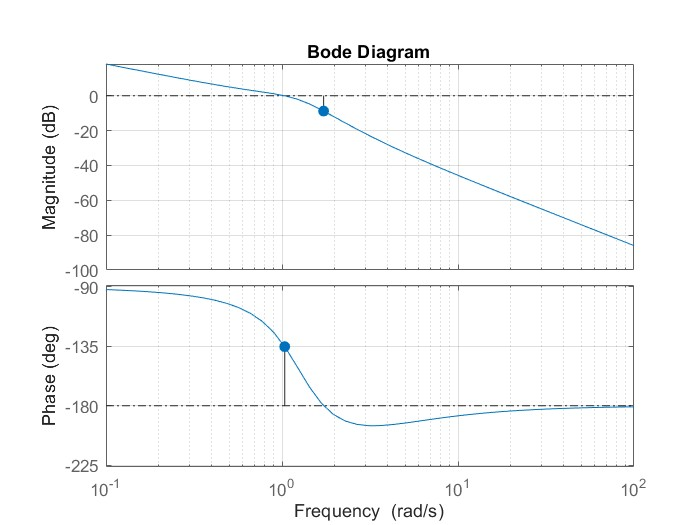
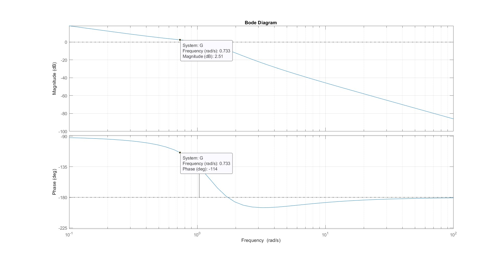

# clase-26-09-2024
# Diseño de redes de atraso por análisis de frecuencia
Para analizar un sistema basándonos en su respuesta a distintas frecuencias podemos utilizar dos métodos, cada uno con ventajas y desventajas.

## 1. Diseño por diagrama de bode:
en este método de diseño, contamos con tres sub métodos con características diferentes:
### 1.1 control por adelanto de fase:
Este tiene la característica de hacer funcionar un sistema más rápido, pero a cambio, este será más vulnerable al ruido.
### 1.2 control por atraso de fase:
Este a diferencia del anterior reduce la susceptibilidad del sistema al ruido, pero sacrificando velocidad de respuesta.
### 1.3 control en adelanto-atraso de fase:
por último, tenemos una combinación de los dos métodos anteriores, esta toma características de ambos, y si no se necesita algo muy específico, este método puede ser el adecuado.

## 2. Control PID:
Es posible sintonizar un controlador PID basándose en la frecuencia sobre todo teniendo en cuenta que efectos tiene cada etapa en el espectro de la frecuencia:

 ### 2.1 Control PD:
 Esta arquitectura mejora la estabilidad este en la alta frecuencia.
 ### 2.2 control PI
 por otro lado, este control mejora la estabilidad en la baja frecuencia.

## 3. Margen de fase y ganancia:
Estas son dos características que se pueden encontrar en el diagrama de Bode de cualquier sistema, nos ayuda a encontrar características dinámicas del sistema.

## 3.1 Margen de ganancia:
Este es el cambio de ganancia que hace que un sistema sea inestable en lazo abierto, se mide tomando como referencia la fase de 180° y se representa con el símbolo de MG y unidades de dB.

$$MG>0dB$$ es positivo

$$MG<0dB$$ es negativo

## 3.2 Margen de fase:
Es el cambio de fase necesario para inestabilizar un sistema en lazo abierto, se mide tomando como referencia 0dB de ganancia y se representa con el símbolo de MP y unidades de °.

$$MP>-180°$$ es positivo

$$MP<-180°$$ es negativo

Figura 1. Ejemplo margen de fase y magnitud.
## 3.3 Características por margen de ganancia y fase
Si MG y MP son positivos el sistema es estable en lazo cerrado.
sí MG y MP son cero o negativos el sistema puede ser inestable en lazo cerrado.

En la respuesta del sistema, para un sistema de segundo orden lo ideal seria que:

$$MG>=12bD$$ 

$$MP>=60°$$

## 4. procedimiento de diseño
En caso de ya tener un sistema discretizado G(z), este debe volver al dominio del tiempo continuo, por lo que se le debe transformar en G(w) para poder graficar sus diagramas de bode.

### 4.1 redes de atraso:
en este metodo de diseño se ubica un controlador antes del sistema, el cual modificara la respuesta en frecuencia del sistema segun nuestra conveniencia.

$$C(w)=\frac{1+a.T1.W}{1+T1.W}$$

$$0<a<1$$

$$a={10}^{-\frac{α}{20}}$$

$$T1=\frac{10}{Wg.a}$$

Donde Wg es la frecuencia en donde esta ubicada la fase que deseamos y α es la magnitud en la frecuencia Wg.

💡**Ejemplo 1:**
retomando el diagrama de Bode de la figura 1, digamos que queremos mover el margen de fase a 60°, esto lo logramos de la siguiente manera.

Figura 2. Ejemplo redes de atraso.

Como se ve en la imagen ubicamos un cursor en la fase de -114°, esto ya que eset valor se obtienen asi:

$$φ=180°+MP+6°$$

En donde MP es el margen de fase deseado.
De esta misma forma sabemos que: 

$$Wg=0.733Rad/s$$ 

$$α=2.51dB$$ 
